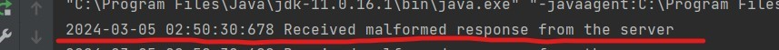

**Steps to run the program from Java Files:**

- Goto the folder where all the java source files are located and open terminal in this folder.
- Write the command **javac CustomSocketFactory.java ServerInterface.java Response.java Server.java Client.java** 
- (Note the ordering should be same as described because server and client classes depends on Response and ServerInterface files)
- This will generate .class files for each source file.
- To run the server write the command **java -cp . Server <PORT> <ServerName>**
- You can write required PORT in place of <PORT> in the command and required Server name in place of Server Name to bind this name with server reference. e.g.

` `java -cp . Server 32000 Server

- This will start the server which will be listening to requests at the given port number
- Now open a second terminal in the same folder and write the command **java -cp . Client <host Address> <PORT><ServerName>**
- Replace host address, PORT and ServerName with server's address, port and name of server e.g. java -cp . Client localhost 32000 Server

- This will start the client in this terminal. Some pre-defined requests will be sent to the server. After that, the client will be run in interactive mode where the user can request put, get or delete from the server

**Sample Run:**

- Once server and client is up we can store and retrieve String based key-value pairs.
- To send a PUT request enter 1. Give required key and value and then hit enter. As shown below on left side, server will log the PUT request and its response. Similarly, on the client shown in the right side we can see the successful PUT request message with given key and value.

- To send a GET request enter 2. Give required key and hit enter. As shown below on left side, server will log the GET request and its response. Similarly, on the client shown in the right side we can see the successful GET request message with given key and value.

- Let’s send a DELETE request for the same key. Select option 3 and hit enter. Now enter the key to delete. Server will log the result and its response and client will also log the response it receives from the server as shown below:

- Now, let’s send an invalid GET request and see what happens. We will send the key that we deleted in the previous step. As we can see below server will log key not found error for this request and client will also log the error message it receives from the server:

- If we try to delete a non-existing key value, we will also get key not found error message as shown below:

- To close the client, choose option 4.

**Multiple clients/Concurrent Requests:**

- Open another terminal in the same folder by following the steps above described and connect to the same server.
- Let’s put a message with key = from2 and value = Hi as shown below

- Let’s now get the message on client 1 and see what we get. As you can see below, we are able to get the message from client 2.

- Now, let’s try to delete this key-value from first client and get it on the second client and see if second client gets key not found error. As you can see below, the value is now deleted and when client 2 tries to get the key-value pair with key = from2 it gets key not found error from server.

**Exception Handling**

**Timeout Handling**

- For client we have created a CustomSocketFactory which enables the timeout mechanism for the client and in the code, we can change the timeout as well. Following is a screenshot for the client code where we are enabling this feature. In our code we are defining max 10 seconds to wait.

- Suppose in the PUT request function of Server we make thread sleep for 1 hour. At client side we can see following message, indicating that timeout has occurred and it continues with next requests.

**Malformed Response**

- Suppose the server sends a malformed response. The client will try to cast it to a Response object but if it is malformed the client will not be able to cast it and exception is thrown and it is handled by displaying proper message indicating reception of a malformed response as shown below. In the server you can mimic it by returning (Response) new Object() instead of Response.

**Unmarshall Exception**

- If client request gets malformed along the way to server, it will be unable to unmarshall the parameters and throw Unmarshall Exception which is handled by client by displaying error message and continuing with remaining requests as shown below. To mimic this try throwing Unmarshall Exception in any of request methods.

**		
